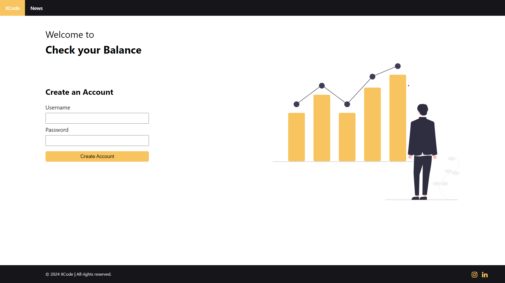

# Check your Balance 

 

    Building a simple Check your Balance app in JavaScript with daily updates to illustrate various concepts and logic is a fantastic way to help developers learn.

<h3 style="font-family: 'Times New Roman', Times, serif;">Here's a basic outline of what the app include:</h3>
<ol>
    <li>Basic Structure: Set up the HTML, CSS, and JavaScript files for the app.</li>
    <li>Display Balance: Show the current balance on the screen.</li>
    <li>Update Balance: Allow the user to add or subtract funds from the balance.</li>
    <li>Validation: Validate user input to ensure it's a valid number.</li>
    <li>Styling: Make the app visually appealing with CSS.</li>
    <li>Daily Updates: Introduce new concepts or improve existing code daily.</li>
</ol>